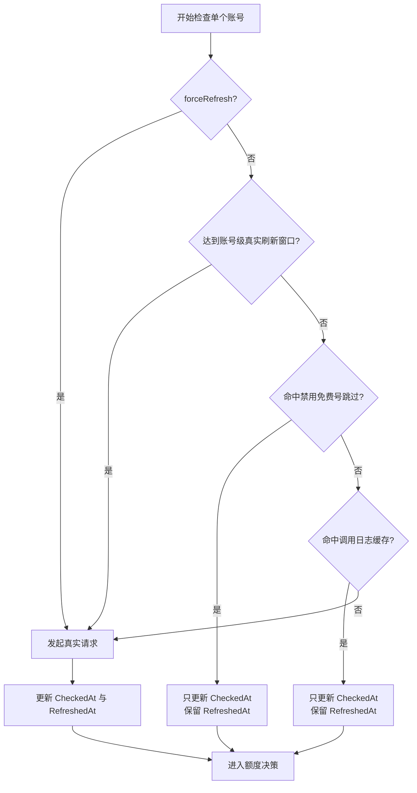
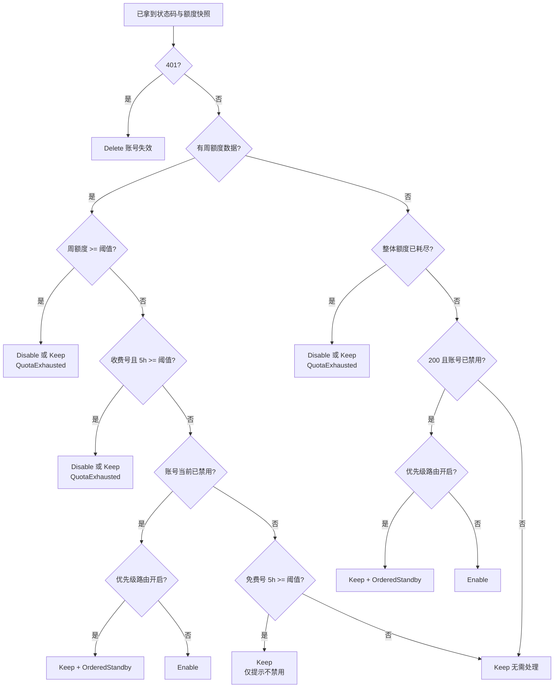
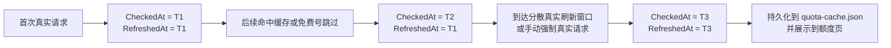
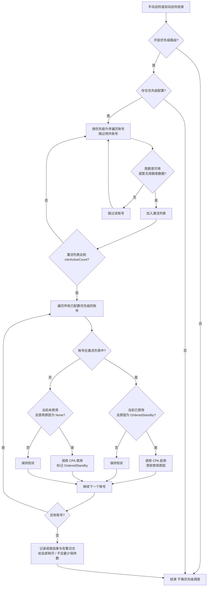

# Codex Patrol 开发文档

> 本文档基于实际代码编写，与项目结构保持对齐，方便快速定位代码和理解模块关系。
> 代码变动时请同步更新本文档。

---

## 目录

- [项目结构](#项目结构)
- [技术栈与约束](#技术栈与约束)
- [启动流程](#启动流程)
- [后端架构](#后端架构)
  - [Services（服务层）](#services服务层)
  - [Api（接口层）](#api接口层)
  - [Models（数据模型）](#models数据模型)
  - [Serialization（序列化）](#serialization序列化)
- [前端架构](#前端架构)
  - [页面与 JS 模块对照表](#页面与-js-模块对照表)
  - [共享模块](#共享模块)
- [配置与持久化文件](#配置与持久化文件)
- [模块依赖关系](#模块依赖关系)
- [后台服务说明](#后台服务说明)
- [巡检核心流程](#巡检核心流程)
- [额度缓存策略与时间语义](#额度缓存策略与时间语义)
- [关键流程图](#关键流程图)
- [优先级路由](#优先级路由)
- [测试](#测试)

---

## 项目结构

```
codex-patrol/
├── CodexPatrol.sln                          # VS 解决方案
├── README.md                                # 项目介绍
├── DEVELOPMENT.md                           # 本文档
├── .gitignore
├── image/                                   # README 页面截图
├── src/CodexPatrol/                         # 主项目
│   ├── Program.cs                           # 入口：配置、DI、中间件
│   ├── CodexPatrol.csproj                   # .NET 10, PublishAot=true
│   ├── appsettings.json                     # 业务参数默认值
│   ├── dotnet-tools.json                    # dotnet-ef 工具引用
│   ├── Properties/
│   │   ├── launchSettings.json              # 开发启动配置
│   │   └── PublishProfiles/FolderProfile.pubxml  # 发布配置
│   ├── Api/                                 # API 路由定义
│   ├── Models/                              # 数据模型与 DTO
│   ├── Serialization/                       # JSON Source Generator
│   ├── Services/                            # 核心业务逻辑
│   └── wwwroot/                             # 前端静态文件
│       ├── css/app.css                      # 全局样式
│       ├── *.html                           # 各页面
│       └── js/                              # 各页面 JS + 共享模块
└── tests/CodexPatrol.Tests/                 # 单元/集成测试
```

---

## 技术栈与约束

| 项 | 说明 |
|---|---|
| 运行时 | .NET 10 |
| 发布方式 | Native AOT 单文件 |
| 后端框架 | ASP.NET Core Minimal API |
| 前端 | 嵌入式静态 HTML/CSS/JS |
| JSON 序列化 | `System.Text.Json` + Source Generator（**禁用反射**） |
| 数据存储 | 进程内内存，无数据库 |
| 敏感配置 | `connection.json`，不入库 |
| 上游兼容基线 | `CLI Proxy API v7.1.19` |

**AOT 约束要点**：
- 禁止 `Configuration.Bind()` / `Configuration.Get<T>()`，配置逐项读取
- JSON 序列化通过 `AppJsonContext` 注册类型，编译时生成代码
- 所有 DTO 必须在 `AppJsonContext` 中声明 `[JsonSerializable]`

---

## 启动流程

入口文件：`src/CodexPatrol/Program.cs`

```
1. EnsureAppSettingsExists()
   └─ 若 appsettings.json 不存在，写入默认配置

2. 读取配置（逐项，AOT 兼容）
   ├─ PatrolSettings 从 appsettings.json 的 PatrolSettings 节
   └─ LoadConnection() 从 connection.json 或环境变量读取 CpaBaseUrl / ManagementKey

3. DI 注册
   ├─ PatrolSettings（单例）
   ├─ AuthService（单例）
   ├─ OperationLogFileWriter（单例）
   ├─ CpaClient（单例，手动创建 HttpClient）
   ├─ RuntimeStore（单例）
   ├─ InspectionEngine（单例）
   ├─ AutoPollingService（HostedService）
   └─ UsageQueueMonitor（HostedService）

4. JSON 序列化配置 → AppJsonContext.Default

5. 中间件管道
   ├─ 全局异常处理器（写本地日志 + 返回 500）
   ├─ 登录认证中间件（未设密码→/setup.html，未登录→/login.html）
   ├─ UseDefaultFiles + UseStaticFiles
   └─ API 路由映射（7 个分组）

6. app.Run()
```

---

## 后端架构

### Services（服务层）

所有服务位于 `src/CodexPatrol/Services/`。

#### `CpaClient.cs`

CPA Management API 的 HTTP 客户端封装。

| 方法 | 对应 CPA API | 说明 |
|---|---|---|
| `GetAuthFilesAsync()` | `GET /v0/management/auth-files` | 获取账号列表 |
| `RequestCodexUsageAsync()` | `POST /v0/management/api-call` | 探测 Codex 额度（代理调用 `chatgpt.com/backend-api/wham/usage`） |
| `DisableAccountAsync()` | `PATCH /v0/management/auth-files` | 禁用账号 |
| `EnableAccountAsync()` | `PATCH /v0/management/auth-files` | 启用账号 |
| `DeleteAccountAsync()` | `DELETE /v0/management/auth-files` | 删除账号 |
| `GetUsageRawAsync()` | `GET /v0/management/usage-queue` | 拉取使用队列原始数据 |
| `PopUsageQueueAsync()` | `POST /v0/management/usage-queue` | 消费使用队列 |

#### `InspectionEngine.cs`

巡检引擎，执行账号探测、决策和动作执行。

| 方法 | 说明 |
|---|---|
| `LoadCandidatesAsync()` | 加载候选账号（筛选 provider，排除例外名单） |
| `LoadLastUsageByAuthIndexAsync()` | 加载使用活动数据（用于缓存策略） |
| `InspectAccountAsync()` | 单账号探测（含缓存策略判断） |
| `InspectAccountsAsync()` | 批量探测，按批次并发，带进度回调 |
| `ExecuteActionsAsync()` | 执行禁用/删除/启用动作，信号量控制并发 |
| `ResolveDecision()` | **核心决策逻辑**（见下方巡检流程） |

#### `CodexQuotaParser.cs`

静态工具类，解析 Codex 额度 API 的原始 JSON 响应。

| 方法 | 说明 |
|---|---|
| `ParseQuotaSnapshot()` | 主入口：将原始 JSON 解析为结构化的 `CodexQuotaSnapshot` |
| `ClassifyWindows()` | 按 `limit_window_seconds` 区分 5 小时（18000s）/ 周（604800s）窗口 |
| `NormalizePlanType()` | 归一化套餐类型（Free/Plus/Team/Pro/ProLite） |
| `GetWeeklyUsedPercent()` | 获取周额度使用率 |
| `GetFiveHourUsedPercent()` | 获取 5 小时额度使用率 |
| `IsQuotaReached()` | 判断额度是否达到阈值 |
| `FormatDuration()` | 格式化为中文时长（如"2天3小时后重置"） |

#### `QuotaCachePolicy.cs`

静态工具类，额度缓存策略判断。

| 方法 | 说明 |
|---|---|
| `TryReuseQuota()` | 满足条件时复用缓存：快照有效、无窗口过期、无新调用活动 |
| `TrySkipDisabledFreeQuota()` | 已禁用免费号且周额度未重置时跳过探测 |
| `GetScheduledRealRefreshAt()` | 根据 `(siteId, accountName)` 稳定计算账号进入真实刷新窗口的时间 |
| `HasReachedScheduledRealRefreshAt()` | 判断账号是否已进入必须执行真实请求的时间窗口 |

#### `RuntimeStore.cs`

中央内存状态仓库，最大的服务文件（1600+ 行）。管理所有运行时状态，按站点隔离。

| 功能分组 | 主要方法 |
|---|---|
| **站点管理** | `CreateSite()`, `DeleteSite()`, `GetSites()`, `HasSite()`, `ResolveSiteId()` |
| **配置读写** | `GetSettings()`, `UpdateSettings()`, `ApplySettings()` |
| **例外名单** | `GetExceptions()`, `AddException()`, `RemoveException()`, `SetExceptions()` |
| **账号数据** | `SetAccounts()`, `GetAccounts()`, `GetAccount()`, `UpdateAccountDisabledState()` |
| **额度数据** | `SetQuota()`, `GetQuotas()`, `GetQuota()`, `ClearQuotas()` |
| **巡检运行时** | `Get/SetLastRun()`, `Is/SetPollingState()`, `Get/SetNextScheduledAt()` |
| **操作日志** | `GetOperationLogs()`, `AddOperationLog()`, `AddExceptionLog()` |
| **进度追踪** | `StartProgress()`, `UpdateProgress()`, `CompleteProgress()`, `FailProgress()` |
| **使用活动** | `MarkAccountUsage()`, `HasAccountUsage()`, `ClearAccountUsage()` |
| **持久化** | 自动读写 `patrol-config.json`、`connection.json`、`quota-cache.json` |

补充说明：额度快照输出和持久化都会保留 `CheckedAt` / `RefreshedAt`；`FromCache` / `CacheReason` 只作为运行时展示信息，不写回持久化文件。

#### `SiteRuntimeState.cs`

单站点运行时状态容器，由 `RuntimeStore` 为每个站点创建。

包含：`PatrolSiteSettings`、例外名单（`HashSet<string>`）、额度（`ConcurrentDictionary`）、账号（`ConcurrentDictionary`）、操作日志（`ConcurrentQueue`）、巡检结果、进度状态、使用监控状态。

两个锁对象：`SyncRoot`（通用状态锁）、`ProgressLock`（进度专用锁，避免死锁）。

#### `AuthService.cs`

本地认证服务。

- 密码哈希：PBKDF2-SHA256（10 万次迭代，16 字节盐，32 字节哈希）
- 会话令牌：`Base64Url(payload).Base64Url(HMAC-SHA256 签名)`，7 天有效期
- 密码修改后旧令牌自动失效（签名密钥派生自密码哈希）
- 密码哈希持久化到 `appsettings.json` 的 `loginPasswordHash` 字段

#### `AutoPollingService.cs`

后台定时巡检服务（`BackgroundService`），详见[后台服务说明](#后台服务说明)。

#### `UsageQueueMonitor.cs`

后台使用队列监控（`BackgroundService`），详见[后台服务说明](#后台服务说明)。

#### `OperationLogFileWriter.cs`

本地文件日志写入器。

- 操作日志按主题分文件落盘：`Inspection.log`、`Quota.log`、`Account.log`、`UsageQueue.log`、`Startup.log`、`System.log`
- 异常日志 → `logs/{yyyy-MM-dd}/Error.log`（含完整堆栈）
- 线程安全（文件锁），非阻塞（所有写入包裹 try-catch）

#### `UsageActivityAnalyzer.cs`

静态工具类，从 CPA usage 数据中提取各账号最近调用时间。

`BuildLastUsageByAuthIndex()` — 递归扫描 JSON 提取所有 `auth_index` / `timestamp` 对，保留每个 auth_index 的最新时间戳。

---

### Api（接口层）

所有接口位于 `src/CodexPatrol/Api/`，采用 Minimal API + 扩展方法模式，每个文件定义一组路由。

#### 认证 `/api/auth` — `AuthEndpoints.cs`

| 方法 | 路径 | 说明 |
|---|---|---|
| GET | `/status` | 检查是否已设密码及登录状态 |
| POST | `/setup` | 首次设置密码（创建会话 Cookie） |
| POST | `/login` | 登录（创建会话 Cookie） |
| POST | `/logout` | 注销（清除 Cookie） |

#### 巡检 `/api/inspection` — `InspectionEndpoints.cs`

| 方法 | 路径 | 说明 |
|---|---|---|
| POST | `/run` | 手动执行巡检（含并发控制、进度追踪、自动动作执行、账号刷新） |
| POST | `/execute` | 执行指定的巡检决策 |
| GET | `/status` | 获取轮询状态、常规下次巡检时间、额度重置检查时间 |
| GET | `/last-run` | 获取上次巡检结果 |
| POST | `/auto/start` | 启动自动轮询 |
| POST | `/auto/stop` | 停止自动轮询 |
| POST | `/refresh-quotas` | 刷新全部额度（含例外账号） |

#### 额度 `/api/quotas` — `QuotaEndpoints.cs`

| 方法 | 路径 | 说明 |
|---|---|---|
| GET | `/` | 获取全部额度快照 |
| POST | `/refresh` | 刷新全部额度（含例外账号） |
| POST | `/{name}/refresh` | 刷新单个账号额度 |

#### 例外名单 `/api/exceptions` — `ExceptionEndpoints.cs`

| 方法 | 路径 | 说明 |
|---|---|---|
| GET | `/` | 获取例外名单 |
| POST | `/` | 添加单个账号到例外名单 |
| PUT | `/` | 替换整个例外名单 |
| DELETE | `/{name}` | 移除单个例外账号 |

#### 设置 `/api/settings` — `SettingsEndpoints.cs`

| 方法 | 路径 | 说明 |
|---|---|---|
| GET | `/sites` | 获取站点列表 |
| POST | `/sites` | 创建新站点 |
| DELETE | `/sites/{siteId}` | 删除站点（要求站点数 > 1 且非运行中） |
| GET | `/` | 获取当前站点配置（隐藏 ManagementKey） |
| PUT | `/` | 保存站点配置 |

#### 账号 `/api/accounts` — `AccountEndpoints.cs`

| 方法 | 路径 | 说明 |
|---|---|---|
| GET | `/` | 获取账号列表 |
| POST | `/refresh` | 从 CPA 重新加载账号 |
| POST | `/{name}/disable` | 禁用账号（同步内存状态） |
| POST | `/{name}/enable` | 启用账号（同步内存状态） |

#### 运行时 `/api/runtime` — `RuntimeEndpoints.cs`

| 方法 | 路径 | 说明 |
|---|---|---|
| GET | `/logs` | 获取操作日志（默认 200 条） |
| GET | `/progress` | 获取当前进度状态 |
| GET | `/usage-monitor` | 获取使用监控状态 |

---

### Models（数据模型）

所有模型位于 `src/CodexPatrol/Models/`。

#### 配置模型

| 文件 | 主要类型 | 说明 |
|---|---|---|
| `PatrolSettings.cs` | `PatrolSettings` | 全局配置（连接信息 + 业务参数 + 登录哈希） |
| `PatrolSiteSettings.cs` | `PatrolSiteSettings` | 单站点完整配置，含 `Clone()` |
| | `MultiSiteConnectionConfig` | `connection.json` 多站点格式（兼容旧版单站点字段） |
| | `CpaConnectionSite` | 单站点敏感连接信息 |
| | `PatrolSiteConfig` | 单站点非敏感配置（例外名单 + 巡检参数） |
| `PatrolConfig.cs` | `PatrolConfig` | `patrol-config.json` 根结构 |
| | `PersistedPatrolSettings` | 可持久化的巡检参数，含 `FromRuntime()` / `ApplyTo()` 转换方法 |
| `ExceptionConfig.cs` | `ExceptionConfig` | 旧版单站点例外配置格式 |

#### CPA 接口模型

| 文件 | 主要类型 | 说明 |
|---|---|---|
| `AuthFileItem.cs` | `AuthFileItem`, `AuthFilesResponse` | CPA 账号列表响应（双命名兼容 snake_case / camelCase） |
| `CpaApiCallModels.cs` | `ApiCallRequest`, `ApiCallResponse` | CPA api-call 请求/响应 |
| | `AuthFilePatchRequest` | 启用/禁用请求体 |
| | `ActionOutcome` | 动作执行结果 |

#### Codex 额度模型

| 文件 | 主要类型 | 说明 |
|---|---|---|
| `CodexQuotaModels.cs` | `CodexUsagePayload`, `CodexRateLimitInfo`, `CodexUsageWindow` | 原始 Codex usage API 响应结构 |
| `CodexQuotaWindowSnapshot.cs` | `CodexQuotaSnapshot`, `CodexQuotaWindowSnapshot` | 解析后的额度快照（含 `CheckedAt`、`RefreshedAt`、`disableReason`） |

#### 巡检模型

| 文件 | 主要类型 | 说明 |
|---|---|---|
| `InspectionDecision.cs` | `InspectionAction` 枚举 | Keep / Delete / Disable / Enable |
| | `AutoActionMode` 枚举 | None / Disable / Delete |
| | `InspectionDecision` | 单账号巡检决策 |
| | `InspectionRunResult` | 单次巡检结果汇总 |

#### 运行时模型

| 文件 | 主要类型 | 说明 |
|---|---|---|
| `RuntimeModels.cs` | `OperationLogEntry` | 操作日志条目 |
| | `RuntimeProgressState` | 实时进度快照 |
| `PersistedQuotaState.cs` | `PersistedQuotaState`, `PersistedQuotaSiteState` | 额度缓存持久化结构 |
| `ApiDtos.cs` | 16 个 DTO | API 请求/响应数据传输对象 |

---

### Serialization（序列化）

`src/CodexPatrol/Serialization/AppJsonContext.cs`

AOT 兼容的 JSON Source Generator 上下文。通过 `[JsonSerializable]` 注册所有需要序列化/反序列化的类型（40+ 个）。**新增任何 DTO 都必须在此注册，否则 AOT 发布后运行时会报错。**

---

## 前端架构

所有前端文件位于 `src/CodexPatrol/wwwroot/`。每个页面是一个独立的 HTML 文件，加载共享 CSS 和对应的 JS 模块。

### 页面与 JS 模块对照表

| HTML 页面 | JS 模块 | 功能 |
|---|---|---|
| `index.html` | — | 自动跳转到 `/dashboard.html` |
| `dashboard.html` | `js/dashboard-page.js` | 仪表盘：状态统计、使用监控、最近巡检摘要 |
| `inspection.html` | `js/inspection-page.js` | 巡检管理：手动/自动巡检控制、实时进度、结果表格 |
| `quotas.html` | `js/quotas-page.js` | 额度管理：分页额度卡片、状态筛选、进度条、手动刷新 |
| `exceptions.html` | `js/exceptions-page.js` | 例外名单：表格展示、弹窗选择添加、逐个移除 |
| `settings.html` | `js/settings-page.js` | 系统设置：站点管理 + 巡检策略两个 Tab |
| `operations.html` | `js/operations-page.js` | 操作日志：进度展示、日志列表、Tab 筛选 |
| `login.html` | `js/login-page.js` | 登录页：检查登录状态、密码登录、失败提示 |
| `setup.html` | `js/setup-page.js` | 首次密码设置页：校验确认密码并完成初始化 |

### 共享模块

#### `js/quotas-page.js` — 额度管理页关键行为

- 顶部操作：刷新全部额度、真实请求刷新全部、刷新当前页
- 分页展示额度卡片，仅保留顶部分页组件
- 状态筛选：显示全部、仅禁用、仅启用、仅错误
- 单账号"刷新额度"按钮固定走真实请求（`force=true`）
- 单账号启用/禁用按钮直接调用 `/api/accounts/{name}/enable|disable`
- 卡片同时展示检查时间、真实刷新时间、缓存依据、优先级标签和禁用原因标签
- 日志会区分真实请求、缓存复用、跳过检查，并在真实请求时带出真实刷新时间
- 同步展示运行进度和最近日志

#### `js/common.js` — 通用工具函数

| 函数 | 说明 |
|---|---|
| `api(url, options)` | Fetch 封装，自动 JSON 处理、错误提取、401/403 重定向 |
| `appendSiteId(url)` | 自动追加 `?siteId=` 参数 |
| `loadSites()` | 加载站点列表 |
| `getSelectedSiteId()` / `setSelectedSiteId()` | localStorage 站点选择 |
| `showToast()` | Toast 提示 |
| `refreshAccounts()` / `getAccounts()` | 账号数据加载与缓存 |
| `loadExceptionNames()` | 加载例外名单 |
| `getRuntimeProgress()` | 获取实时进度 |
| `getOperationLogs()` | 获取操作日志 |
| `formatDate()` / `escapeHtml()` | 工具函数 |

#### `js/layout.js` — 共享页面布局

- 定义 6 个导航项（仪表盘、额度、巡检、日志、例外、设置），含 SVG 图标
- `renderLayout()` — 生成完整页面骨架：侧边栏 + 顶栏（站点切换器 + 注销）+ 内容区 + Toast 容器
- 侧边栏折叠/展开，状态持久化到 localStorage
- `bindSiteSwitcher()` — 站点下拉框填充与切换

---

## 配置与持久化文件

| 文件 | 路径 | 是否入库 | 说明 |
|---|---|---|---|
| `appsettings.json` | 与可执行文件同目录 | 是 | 业务参数默认值、登录密码哈希 |
| `connection.json` | 与可执行文件同目录 | **否** | 各站点 CPA 地址和管理密钥 |
| `patrol-config.json` | 与可执行文件同目录 | **否** | 例外名单、各站点巡检参数 |
| `quota-cache.json` | 与可执行文件同目录 | **否** | 额度快照缓存（进程关闭时保存） |
| `logs/{date}/Inspection.log` 等 | 运行时生成 | **否** | 按主题拆分的操作日志 |
| `logs/{date}/Error.log` | 运行时生成 | **否** | 异常日志 |

环境变量覆盖：`CPA_BASE_URL`、`CPA_MANAGEMENT_KEY`（优先级高于 connection.json）。

---

## 模块依赖关系

```
Program.cs（入口）
  ├── PatrolSettings（全局配置）
  ├── AuthService ← PatrolSettings
  ├── OperationLogFileWriter
  ├── CpaClient ← HttpClient
  ├── RuntimeStore ← PatrolSettings, OperationLogFileWriter
  │     └── SiteRuntimeState（每站点一个实例）
  ├── InspectionEngine ← CpaClient, RuntimeStore
  │     ├── CodexQuotaParser（静态）
  │     └── QuotaCachePolicy（静态）
  ├── AutoPollingService : BackgroundService ← InspectionEngine, RuntimeStore
  └── UsageQueueMonitor : BackgroundService ← CpaClient, RuntimeStore
        └── UsageActivityAnalyzer（静态）

API 路由依赖：
  AuthEndpoints        → AuthService
  InspectionEndpoints  → InspectionEngine, RuntimeStore
  QuotaEndpoints       → InspectionEngine, RuntimeStore
  ExceptionEndpoints   → RuntimeStore
  SettingsEndpoints    → RuntimeStore
  AccountEndpoints     → CpaClient, RuntimeStore
  RuntimeEndpoints     → RuntimeStore
```

---

## 后台服务说明

### AutoPollingService

启动后进入 5 秒轮询循环，对每个已启用站点：

1. 同步账号列表（首次或需要时）
2. 对达到账号级真实刷新窗口的非例外账号执行小批量保鲜真实刷新（`TryRefreshScheduledRealQuotasAsync`）
3. 若站点未开启自动巡检，则本轮只维护保鲜真实刷新和计划时间，不进入常规巡检
4. 检查是否有已禁用账号的额度已重置（`TryHandleReachedQuotaResetAsync`）
5. 执行完整巡检周期：加载候选 → 探测 → 决策 → 执行动作 → 刷新账号
6. 计算下次执行时间：`轮询间隔 + 随机抖动`（最小间隔 5 分钟）
7. 防重入：上一轮未结束时不开启下一轮

补充说明：保鲜真实刷新通过 `(siteId, accountName)` 的稳定散列，把账号分散到 8 小时 ~ 9 小时 50 分的真实刷新窗口内，保证单账号最长不超过 10 小时未做真实请求。

### UsageQueueMonitor

每 30 秒轮询 CPA usage-queue（必须小于 CPA 队列保留时间 60 秒）：

1. 每次拉取最多 200 条队列数据
2. 提取 `auth_index`，标记对应账号为活跃
3. 活跃标记用于缓存策略：有新调用的账号不复用缓存
4. 站点新增或删除后会在下一轮轮询时自动感知，无需重启服务
5. 除应用进程真正停止外，普通超时、单站点失败、临时异常都只记日志并继续运行
6. 仅在明确返回 404 时标记该站点不支持 usage-queue，并停止该站点的后续轮询

---

## 巡检核心流程

候选账号默认通过 `LoadCandidatesAsync(... includeExceptions: false)` 排除例外名单；额度刷新接口可显式包含例外账号。

核心决策逻辑位于 `InspectionEngine.ResolveDecision()`：

| 场景 | 当前决策 |
|---|---|
| `401` 响应 | `Delete`，账号失效 |
| 免费号周额度 ≥ 阈值 | 未禁用 → `Disable`；已禁用 → `Keep + QuotaExhausted` |
| 收费号周额度 ≥ 阈值 | 未禁用 → `Disable`；已禁用 → `Keep + QuotaExhausted` |
| 收费号 5 小时额度 ≥ 阈值 | 未禁用 → `Disable`；已禁用 → `Keep + QuotaExhausted` |
| 已禁用账号额度恢复，且优先级路由关闭 | `Enable`；免费号只看周额度，收费号需周额度和 5 小时额度都恢复 |
| 已禁用账号额度恢复，且优先级路由开启 | `Keep + OrderedStandby`，等待优先级调度，不在巡检阶段直接启用 |
| 免费号 5 小时额度 ≥ 阈值但周额度正常 | `Keep`，仅提示，不作为禁用依据 |
| 无周额度数据但整体额度已耗尽 | 未禁用 → `Disable`；已禁用 → `Keep + QuotaExhausted` |
| 请求异常 / 其他正常场景 | `Keep`，容错或无需处理 |

自动动作模式过滤（`FilterAutoActionItems`）：

| 模式 | Delete 建议 | Disable 建议 | Enable 建议 |
|---|---|---|---|
| `none` | 不执行 | 不执行 | 不执行 |
| `disable` | 降级为禁用 | 执行禁用 | 由 `AutoEnableRecovered` 控制；优先级路由开启时不直接执行 |
| `delete` | 执行删除 | 执行禁用 | 由 `AutoEnableRecovered` 控制；优先级路由开启时不直接执行 |

---

## 额度缓存策略与时间语义

位于 `QuotaCachePolicy.cs`，目标是在不牺牲数据真实性的前提下减少对上游 API 的不必要请求。

### 时间字段语义

| 字段 | 含义 | 命中缓存 / 免费号跳过 | 真实请求 |
|---|---|---|---|
| `CheckedAt` | 最近一次检查/评估该账号额度的时间 | 更新为本次检查时刻 | 更新为本次请求时刻 |
| `RefreshedAt` | 最近一次真实请求上游额度接口的时间 | 保留上次真实请求时间 | 更新为本次请求时刻 |

### 复用缓存条件（`TryReuseQuota`）

- 存在有效的额度快照
- 所有窗口的额度未过期（未到 `resetAt` 时间）
- 该账号自上次真实刷新后没有新的 API 调用活动
- 未达到该账号分散后的强制真实刷新时间点

### 跳过探测条件（`TrySkipDisabledFreeQuota`）

- 账号已禁用
- 套餐为 `Free`
- 周额度使用率已达到阈值
- 周额度尚未重置

### 强制真实刷新规则

- 每个已启用站点的非例外账号，最长 10 小时内至少有一次真实请求
- `QuotaCachePolicy` 通过稳定散列把账号分散到 8 小时 ~ 9 小时 50 分的真实刷新窗口，避免同一时刻集中打满
- 命中缓存或免费号跳过时，只推进 `CheckedAt`，不推进 `RefreshedAt`
- 真实请求无论成功还是失败，都会同时推进 `CheckedAt` 和 `RefreshedAt`，表示本次确实访问过上游

### 持久化与页面展示

- `quota-cache.json` 持久化 `CheckedAt`、`RefreshedAt`、额度窗口和禁用原因等快照信息
- 额度页面同时展示“检查时间”“真实刷新时间”“缓存依据”
- `FromCache` / `CacheReason` 属于运行时展示态，接口输出会带，持久化时不回写

---

## 关键流程图

### 单账号检查入口流程



### 额度决策流程



### 时间字段推进流程



### 优先级路由调度流程



## 优先级路由

### 概述

优先级路由功能允许按手动排列的顺序依次消费账号，前一个额度耗尽后自动轮转到下一个。与自动巡检配合使用时形成完整的"顺序消费 + 自动轮转"链路。

### 数据模型

- `AccountPriority`（`PatrolSiteSettings.cs`）：账号名 + 优先级序号 + `PendingFirstInspection`
- `DisableReason` 枚举（`InspectionDecision.cs`）：`None` / `QuotaExhausted` / `OrderedStandby` / `ManualDisabled` / `ErrorDisabled`
- `SiteRuntimeState` 新增：`DisableReasons`（ConcurrentDictionary）、`AccountPriorities`（ConcurrentDictionary，值为 `AccountPriority`）
- 配置入口：设置页面开关 + 独立优先级路由页面（`priority.html` / `priority-page.js`）

### 持久化

优先级数据存储在 `patrol-config.json`，不引入额外 JSON 文件：

- `sites[].accountPriorities`：账号优先级列表（包含 `name` / `priority` / `pendingFirstInspection`）
- `sites[].settings.priorityRoutingEnabled`：开关
- `sites[].settings.priorityMinActiveCount`：最少保持启用数（1-10，默认 2）

### 与 CPA 优先级同步

保存 `/api/settings/priority-routing` 后，服务端会在本地保存完成后继续同步 CPA 的账号优先级：

- 先调用 `GET /v0/management/auth-files` 读取 CPA 当前账号及其 `priority`
- 按账号名做大小写不敏感匹配，发现 CPA 重名账号或本地账号缺失时停止远端同步
- 本地优先级是“数值越小越优先”，CPA 是“数值越大越优先”，因此会按当前排序映射成 `N..1`
- 仅对优先级有变化的账号调用 `PATCH /v0/management/auth-files/fields`
- PATCH 请求体只包含 `name` 和 `priority`，不会写入 `disabled` 或 `status`
- 会自动跳过例外账号和 `PendingFirstInspection = true` 的待首检账号，避免它们提前影响 CPA 远端选路
- 若 CPA 同步失败，本地配置不回滚，接口通过 `cpaPrioritySyncWarning` 返回告警，前端提示用户

### 巡检后自动重排

当 `PriorityRoutingEnabled = true` 时，手动巡检和自动巡检结束后会按当前额度结果自动重排本地优先级：

1. 新发现账号会先追加到末尾并标记 `PendingFirstInspection = true`
2. 待首检账号必须等下一次真实巡检拿到额度后，才会正式纳入自动排序
3. 免费号按“剩余额度高优先”重排；等价于按周使用率从低到高排序
4. 新免费号会插入到“最后一个仍未达到阈值的已有免费号”后面
5. 已达到阈值的免费号会下沉到底部
6. 收费号不按额度做重新排序
7. 最终会重新编号为唯一的 `1..N`，不会出现重复优先级

### 核心调度逻辑（`AutoPollingService.ApplyPriorityRoutingAsync`）

1. 按优先级升序遍历账号，跳过例外账号和待首检账号
2. 免费号只看周额度，收费号需周额度和 5 小时额度都未达阈值，才算”可用账号”
3. 收集可用账号直到达到 `minActiveCount`
4. 进入 active 的禁用账号（不在例外名单）统一恢复启用，不区分之前的禁用原因
5. 未进入 active 且当前启用的账号执行禁用并标记 `OrderedStandby`

补充说明：优先级路由关闭时，巡检不会自动重排本地顺序，也不会自动同步 CPA 优先级；例外账号不会参与调度，待首检账号也不会提前进入 active 集合。

### 与巡检引擎的协作（`InspectionEngine.ResolveDecision`）

当 `priorityRoutingEnabled = true` 时：
- 已禁用但额度恢复的账号 → `Keep` + `OrderedStandby`（不自动 Enable，交给优先级调度）
- 无额度数据但状态恢复的账号 → `Keep` + `OrderedStandby`
- `FilterAutoActionItems` 过滤掉 Enable 决策，避免与优先级调度冲突

### 额度恢复流程

1. 自动/手动巡检发现已禁用账号额度恢复 → 巡检引擎标记建议启用，优先级路由开启时交由调度统一处理
2. 优先级路由按排列顺序从高到低遍历，选 active 集合（免费号只看周额度，收费号周额度和 5 小时额度都不能到阈值）
3. 进入 active 集合的账号如果当前禁用且不在例外名单，统一恢复启用（不区分之前是 QuotaExhausted / OrderedStandby / ManualDisabled）
4. 未进入 active 且当前启用的账号，会被置为待命禁用（OrderedStandby）
5. 恢复的账号不会跳过中间排队的账号，严格按优先级顺序轮转

### 功能组合场景

| 自动巡检 | 优先级路由 | 行为 |
|---|---|---|
| 关 | 关 | CPA 默认 round-robin，无自动处理 |
| 开 | 关 | 自动禁用耗尽/启用恢复，不控制顺序 |
| 关 | 开 | 可通过手动巡检触发优先级调度，但没有后台自动调度 |
| 开 | 开 | 顺序消费 + 自动发现 + 自动轮转（推荐） |

### API 端点

| 方法 | 路径 | 说明 |
|---|---|---|
| GET | `/api/settings/priority-routing` | 获取优先级路由配置 |
| PUT | `/api/settings/priority-routing` | 更新配置（开关 + 最小启用数 + 排序），并在保存后增量同步 CPA `priority` |

---

## 测试

测试项目：`tests/CodexPatrol.Tests/`，基于 xUnit。

| 文件 | 测试数 | 覆盖内容 |
|---|---|---|
| `AuthServiceTests.cs` | 4 | 密码设置/验证、哈希持久化、会话令牌、篡改检测 |
| `CpaApiTests.cs` | 7 | CPA 连接、账号列表、额度探测、禁用/启用（集成测试，需真实 CPA） |
| `QuotaCachePolicyTests.cs` | 8 | auth_index 提取、缓存复用/跳过逻辑、窗口过期判断 |
| `SettingsPersistenceTests.cs` | 54 | 站点配置持久化、例外名单持久化、额度快照持久化、巡检引擎缓存行为、定时计算、队列监控日志、优先级路由调度（含收费号 5 小时额度判定、手动禁用恢复、待首检与例外跳过）、自动重排、CPA 优先级同步、禁用原因管理、启动预热 |
