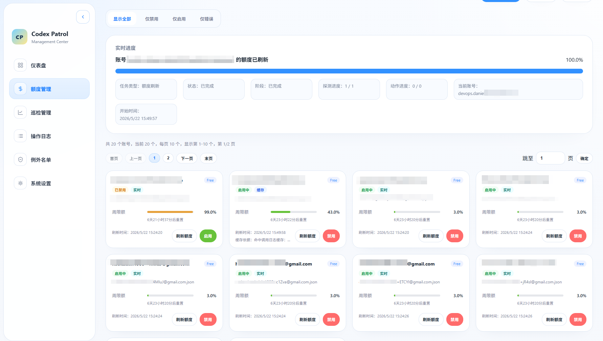
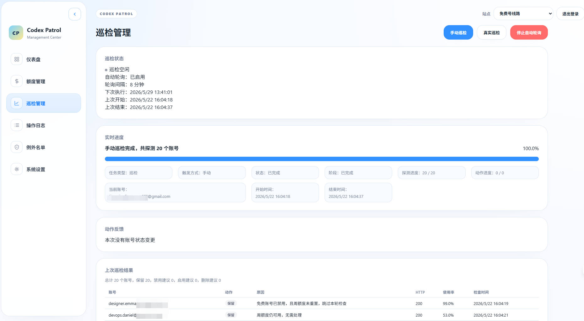
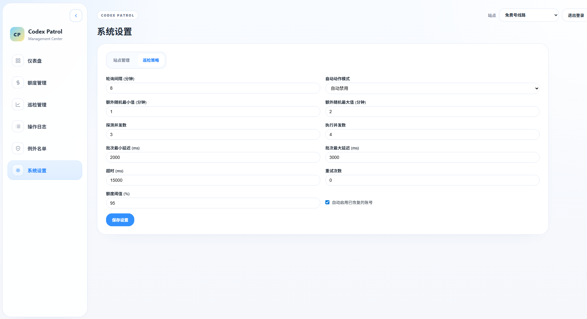
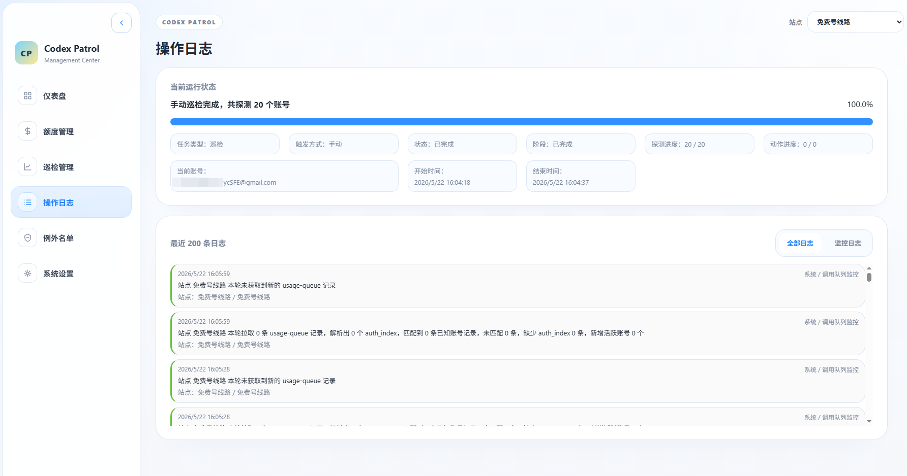

# Codex Patrol

Codex Patrol 是一个面向 **Codex 账号巡检、额度管理和自动处理** 的独立管理面板。

它作为 [CPA-Manager](https://github.com/seakee/CPA-Manager) 的配套子项目存在，但运行上是独立的：通过 CPA Management API 获取账号列表、探测 Codex 额度、执行启用/禁用/删除动作，并提供一套专门针对 Codex 账号维护场景的轻量后台界面。

基于 .NET 10 Native AOT 构建，编译为单文件可执行程序，无外部运行时依赖，所有运行态数据保存在内存中，无需数据库。

项目仓库：<https://github.com/kaixin1995/CodexPatrol>

## 这个项目是做什么的

如果你手里有一批通过 CPA 管理的 Codex 账号，这个项目主要解决的是下面这些问题：

- 哪些账号已经失效，需要删除
- 哪些账号周额度已经接近耗尽，需要临时禁用
- 哪些账号之前被禁用了，但额度已经恢复，可以重新启用
- 哪些账号当前额度异常、刷新失败或上游返回错误，需要单独排查
- 多个站点下的 Codex 账号，如何统一查看、统一巡检、统一处理

换句话说，Codex Patrol 不是通用管理面板，而是一个更偏向 **运维巡检** 的专项工具。

## 适用场景

- 手里维护多组 Codex 账号，需要定期清理失效号
- 需要根据免费号周额度、收费号周额度 / 5 小时额度自动禁用高占用账号
- 想把账号额度、异常状态、启用状态集中展示
- 有多个 CPA 站点，希望按站点隔离管理
- 不希望引入数据库，只想要一个可执行文件直接运行

## 与其他项目的关系

| 项目 | 关系 | 作用 |
|---|---|---|
| [CLI Proxy API (CPA)](https://github.com/router-for-me/CLIProxyAPI) | 上游依赖 | 提供 Management API，Codex Patrol 通过它读取账号、探测额度、执行账号动作 |
| [CPA-Manager](https://github.com/seakee/CPA-Manager) | 参考来源 | 提供 Codex 巡检逻辑、额度解析思路，以及前端页面结构和视觉风格参考 |
| Codex Patrol | 当前项目 | 专注于 Codex 账号巡检、额度管理、自动动作和运行态监控 |

> 版本兼容说明：当前项目使用并验证的上游版本为 **CLI Proxy API v7.1.19**。
> 为避免旧版本接口行为差异导致兼容性问题，建议优先使用该版本，不要直接按更旧版本假定兼容。

## 页面预览

**额度管理**



**巡检管理**



**系统设置**



**操作日志**



## 核心能力

- **巡检**：批量探测 Codex 账号是否失效、额度是否超限、是否可恢复
- **自动处理**：根据策略自动执行禁用、删除、恢复启用
- **额度管理**：集中展示周额度、5 小时额度、代码审查额度等窗口
- **优先级路由**：按手动排列的顺序依次消费账号，前一个耗尽自动轮转到下一个
- **异常排查**：快速筛出错误账号，支持单账号真实刷新
- **多站点隔离**：不同 CPA 站点分别保存配置、账号、额度和例外名单
- **运行时可视化**：查看实时进度、最近日志、自动轮询状态、活跃账号状态

## 功能概览

### 1. 账号巡检

对 Codex 账号执行健康探测，根据上游返回结果自动决策后续动作：

- **失效检测**：账号返回 `401` 时标记为失效，建议删除
- **免费号额度超限检测**：免费号周额度达到阈值（默认 95%）时，建议禁用该账号
- **收费号额度超限检测**：收费号周额度或 5 小时额度任一达到阈值时，建议禁用该账号
- **恢复检测**：已禁用账号额度恢复后，优先级路由关闭时建议立即启用；开启时转入待命，等待优先级调度
- **免费号 5 小时额度**：即使存在 5 小时窗口，也仅按周额度处理
- **异常容错**：请求异常时默认保留，不自动处理

### 2. 自动处理策略

巡检完成后，可根据配置的策略自动执行动作：

| 模式 | 行为 |
|---|---|
| `none` | 仅巡检，不执行任何动作 |
| `disable` | 对失效/超限账号统一执行禁用 |
| `delete` | 对失效账号执行删除，超限账号执行禁用 |
| 启用恢复 | 可单独开启，自动重新启用额度已恢复且当前被禁用的账号 |

### 3. 自动轮询

后台服务按可配置的间隔自动执行巡检：

- 可配置轮询间隔（默认 10 分钟，最小 5 分钟）
- 可配置探测并发数与批次间延迟
- 可配置操作执行并发数
- 可配置请求超时与失败重试次数
- 内置随机抖动（jitter），避免固定整点齐发
- 防重入：上一轮未结束时，不开启下一轮
- 对每个站点的非例外账号做额度保鲜真实刷新，保证最长 10 小时内至少有一次真实请求
- 真实刷新按账号稳定散布到 8 小时 ~ 9 小时 50 分窗口，避免同一时间集中打满

### 4. 额度管理

独立页面展示每个 Codex 账号的额度使用情况：

- **周额度**使用率与重置时间
- **5 小时额度**使用率与重置时间
- **代码审查额度**等其他限额窗口
- 套餐类型识别（Free / Plus / Team / Pro / ProLite）
- 兼容免费号仅有周额度的情况
- 支持按状态筛选：显示全部、仅禁用、仅启用、仅错误
- 支持手动刷新全部或单个账号额度
- 单个账号的"刷新额度"按钮默认走真实请求，不复用缓存
- 页面同时展示“检查时间”和“真实刷新时间”
- 缓存复用 / 免费号跳过时保留历史真实刷新时间，并展示缓存依据
- 巡检完成后自动刷新额度缓存

#### 额度时间字段

| 字段 | 含义 | 命中缓存 / 免费号跳过 | 真实请求 |
|---|---|---|---|
| `CheckedAt` | 最近一次检查/评估时间 | 更新为本次检查时刻 | 更新为本次请求时刻 |
| `RefreshedAt` | 最近一次真实请求刷新时间 | 保留上次真实请求时间 | 更新为本次请求时刻 |

### 5. 例外名单

可将指定账号加入例外名单，排除自动处理：

- 例外账号不参与自动巡检
- 例外账号不参与批量手动巡检
- 例外账号不参与优先级路由调度
- 例外账号不参与 10 小时额度保鲜真实刷新
- 额度页面仍可查看例外账号的额度，也可手动刷新单个账号额度
- 例外名单持久化到本地配置文件，重启后保留

### 6. 优先级路由

按手动排列的顺序依次消费账号，前一个额度耗尽后自动轮转到下一个：

- **独立配置页面**：拖拽排序调整账号消费顺序，排在前面的优先使用
- **最少保持启用数**：始终保持指定数量（默认 2 个）的账号同时启用，保证可用性
- **自动轮转**：结合自动巡检，当前账号额度耗尽时自动禁用并激活下一个待命账号
- **新号待首检**：新加入优先级列表的账号会先标记为“待首检”，下一次巡检拿到真实额度后才参与自动排序与 CPA 优先级同步
- **巡检后自动重排**：免费号巡检后会按剩余额度高优先自动重排；新免费号会插入到最后一个仍可用的已有免费号后面，已耗尽免费号会下沉到底部，收费号不按额度排序
- **恢复排队**：额度恢复的账号不会立即启用，而是排队等待轮到自己的位置
- **禁用原因标记**：区分额度耗尽（QuotaExhausted）、排队待命（OrderedStandby）、手动禁用（ManualDisabled）等不同原因
- **保存后同步 CPA 优先级**：点击保存后会同步更新 CPA 的 `priority` 字段，仅影响 CPA 的选路顺序；本地越小越优先，写入 CPA 时会自动换算为“数值越大越优先”，并会自动跳过例外账号和待首检账号
- **与自动动作解耦**：优先级路由会在手动巡检和自动巡检完成后统一调度；保存配置会立即同步 CPA 顺序，但不会立即改动账号启用/禁用状态

#### 功能组合说明

| 自动巡检 | 优先级路由 | 效果 |
|---|---|---|
| 关 | 关 | CPA 默认策略（round-robin），所有账号平等轮转 |
| 关 | 开 | 可通过手动巡检触发优先级调度，但没有后台自动调度 |
| 开 | 关 | 自动发现并处理额度耗尽/恢复的账号，不控制消费顺序 |
| 开 | 开 | 按顺序消费 + 自动发现额度问题 + 自动轮转（推荐） |

#### 生效时机

保存配置后，会立即同步 CPA 的 `priority` 字段，但不会立刻切换账号状态；需要手动触发一次巡检，或等待下一次自动巡检周期执行后，优先级路由调度才会真正生效。优先级路由关闭时，巡检不会自动重排本地顺序，也不会自动同步 CPA 优先级。若 CPA 同步失败，本地配置仍会保留，并在页面给出告警提示。

### 7. 多站点管理

支持同时管理多个 CPA 实例：

- 每个站点独立配置连接地址、管理密钥和巡检参数
- 每个站点独立维护例外名单和额度数据
- 仪表盘可切换查看不同站点的状态

### 8. 使用活动监控与缓存刷新

后台持续拉取 CPA usage-queue，标记活跃账号，并作为默认缓存刷新依据：

- 实时追踪哪些账号最近有 API 调用
- 仪表盘展示账号活跃状态
- 默认根据调用日志决定哪些账号需要真实刷新，未调用账号优先复用缓存
- 站点设置中的"禁用缓存刷新"默认为关闭；开启后每次巡检都会真实请求，不再根据调用日志决定刷新，适合 CPA 日志模块被禁用导致读不到调用信息的场景

### 9. 登录保护

首次使用时设置密码，后续访问需登录认证：

- 密码以哈希形式存储在本地配置中
- 未设置密码时自动引导到首次设置页面
- API 接口同样受认证保护

### 10. 操作日志

内存中记录最近操作日志，可在页面中查看：

- 巡检探测记录
- 账号动作执行记录（禁用/删除/启用）
- 额度刷新记录
- 系统异常记录

## 页面导航

| 页面 | 功能 |
|---|---|
| 仪表盘 | 站点概览、账号状态总览、活跃账号监控 |
| 巡检管理 | 手动/自动巡检控制、巡检进度、结果查看 |
| 额度管理 | 所有账号额度详情、状态筛选、手动刷新 |
| 优先级路由 | 账号消费顺序配置、拖拽排序、启用/禁用开关 |
| 例外名单 | 添加/移除例外账号 |
| 操作日志 | 查看最近巡检和动作操作记录 |
| 系统设置 | CPA 连接配置、巡检参数调整、多站点管理 |
| 登录页 | 本地密码登录入口 |
| 首设页 | 首次设置本地访问密码 |

## 使用方式概览

通常的使用流程是：

1. 配置 `connection.json`，接入一个或多个 CPA 站点
2. 首次启动后访问面板，先设置本地登录密码
3. 进入系统设置，确认站点参数、轮询策略、自动动作模式
4. 进入优先级路由页面，配置账号消费顺序（可选）
5. 在额度管理页面查看当前账号额度状态和异常账号
6. 在巡检管理页面手动执行巡检，或开启后台自动轮询
7. 结合例外名单、操作日志和状态筛选，持续维护账号池

## 技术架构

- **运行时**：.NET 10，Native AOT 编译
- **后端**：ASP.NET Core Minimal API
- **前端**：嵌入式静态 HTML/CSS/JS
- **状态存储**：进程内内存（`ConcurrentDictionary`）
- **持久化**：`patrol-config.json`（例外名单、站点配置）、`connection.json`（连接信息）、`appsettings.json`（业务参数）、`quota-cache.json`（额度缓存）
- **序列化**：`System.Text.Json` + Source Generator（AOT 兼容，不依赖反射）

## 快速开始

### 前置要求

- 已部署 [CLI Proxy API (CPA)](https://github.com/router-for-me/CLIProxyAPI) **v7.1.19**，并启用 Management API
- 文档与当前实现均以 **v7.1.19** 为兼容基线；如果使用更旧版本，可能出现接口字段或行为不一致的问题

### 配置

在可执行文件同目录下创建 `connection.json`：

```json
{
  "sites": [
    {
      "siteId": "default",
      "name": "我的站点",
      "enabled": true,
      "cpaBaseUrl": "http://localhost:8317",
      "managementKey": "你的管理密钥",
      "provider": "codex"
    }
  ]
}
```

也可通过环境变量 `CPA_BASE_URL` / `CPA_MANAGEMENT_KEY` 覆盖连接信息。

### 运行

```bash
# 开发模式
dotnet run --project src/CodexPatrol

# 发布（Native AOT 单文件）
dotnet publish src/CodexPatrol -c Release -r win-x64 -o ./publish
```

启动后访问 `http://localhost:22014`，首次使用时设置登录密码。

### 默认配置

| 参数 | 默认值 | 说明 |
|---|---|---|
| 监听地址 | `0.0.0.0:22014` | Web 服务监听地址 |
| 轮询间隔 | 10 分钟 | 自动巡检间隔 |
| 随机抖动 | 1~3 分钟 | 避免固定整点齐发 |
| 探测并发 | 3 | 同时探测的账号数 |
| 操作并发 | 4 | 同时执行动作的并发数 |
| 请求超时 | 15 秒 | 单次请求超时 |
| 重试次数 | 0 | 请求失败重试 |
| 自动动作 | disable | 自动禁用超限账号 |
| 额度阈值 | 95% | 触发动作的使用率阈值 |

## 参考项目

本项目的实现主要参考了以下项目：

- **[CPA-Manager](https://github.com/seakee/CPA-Manager)**
  - 参考其 Codex 巡检逻辑、额度解析方式，以及前端页面结构与视觉风格
  - 重点参考位置包括：`src/features/monitoring/codexInspection.ts`、`src/utils/quota/codexQuota.ts`、`src/components/quota/quotaConfigs.ts`、`src/pages/MonitoringCenterPage.tsx`、`src/pages/CodexInspectionPage.tsx`

- **[CLI Proxy API (CPA)](https://github.com/router-for-me/CLIProxyAPI)**
  - 作为上游依赖提供 Management API
  - Codex Patrol 通过它完成账号列表读取、额度探测、账号启用/禁用/删除、usage-queue 监控

## 开发文档

项目内部开发说明、目录索引、额度时间语义、缓存策略和最新流程图请参阅 [DEVELOPMENT.md](./DEVELOPMENT.md)。

## Links

- [LINUX DO](https://linux.do)

## 许可证

与父项目 CPA-Manager 保持一致。
